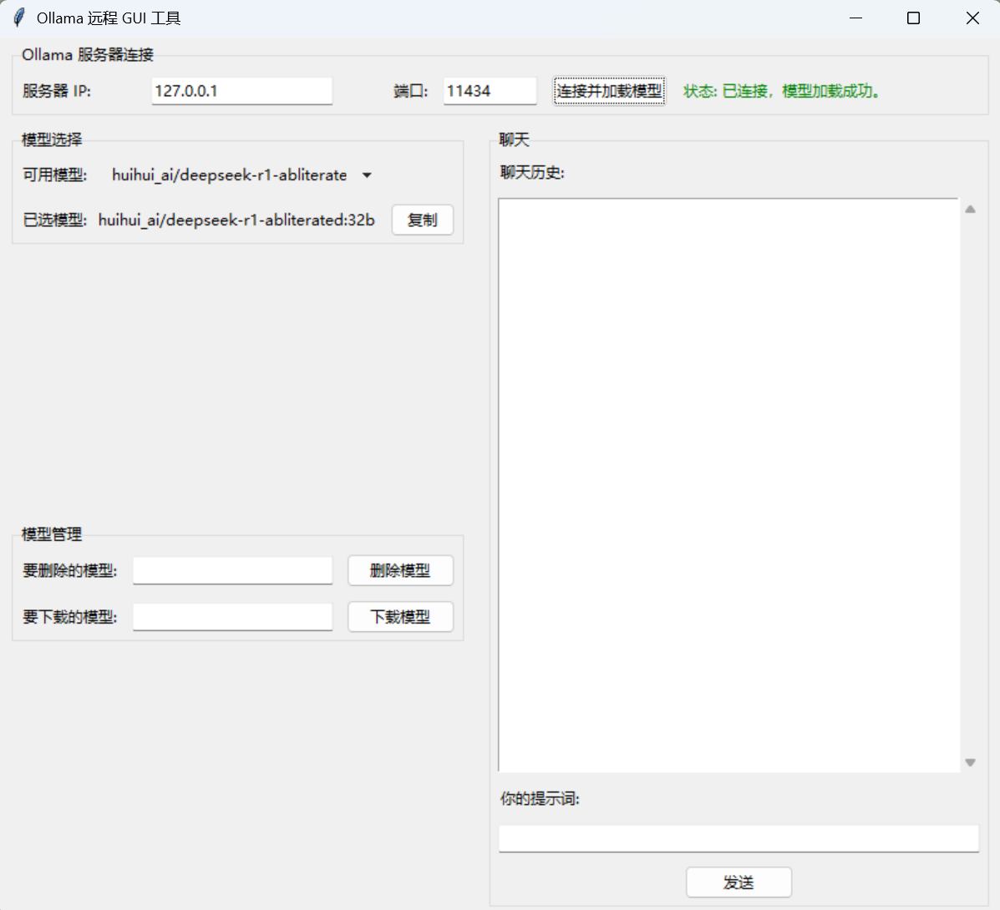

# Ollama 远程 GUI 工具

这是一个使用 Python 的tkinter和requests库开发的图形界面工具，用于通过局域网连接并操作远程部署的 Ollama 模型。它提供了一个简单的界面来加载可用模型、进行文本聊天、删除模型以及下载（pull）模型。

## 功能特性

* **连接管理:** 通过输入服务器 IP 和端口连接到 Ollama 服务端。
* **模型列表:** 获取并显示 Ollama 服务端上可用的模型列表。
* **模型选择:** 从列表中选择一个模型用于聊天或管理。
* **文本聊天:** 与已选模型进行基本的文本交互（非流式）。
* **模型删除:** 输入模型名称，从服务端删除指定的模型。
* **模型下载 (Pull):** 输入模型名称，在服务端开始下载指定的模型，并显示下载进度条和估算速度。
* **模型名称复制:** 一键复制已选模型的名称，方便进行删除或下载操作。
* **多线程操作:** 下载和聊天等耗时操作在后台线程中进行，避免 GUI 冻结。

## 截图-主界面



## 环境要求

* Python 3.x
* `requests` 库 (`pip install requests`)
* 一个正在运行并可通过网络访问的 Ollama 服务端。请确保在服务端设置了 OLLAMA_HOST 环境变量（例如 OLLAMA_HOST=0.0.0.0:11434），并配置防火墙允许客户端访问 Ollama 端口（默认为 11434）。

## 安装

1.  **保存代码:** 将提供的 Python 代码保存为一个.py文件（例如 ollama_gui.py）。
2.  **安装依赖:** 打开终端或命令提示符，运行以下命令安装requests库：
    ```bash
    pip install requests
    ```

## 使用方法

1.  **运行服务端:** 确保你的 Ollama 服务端已启动并可被网络内的其他设备访问。
2.  **运行 GUI 工具:** 打开终端或命令提示符，导航到保存 `ollama_gui.py` 文件的目录，然后运行脚本：
    ```bash
    python ollama_gui.py
    ```
3.  **连接服务端:** 在 GUI 窗口顶部输入 Ollama 服务端的 IP 地址和端口（默认为 11434），然后点击“连接并加载模型”按钮。
4.  **选择模型:** 连接成功后，可用模型列表将显示在下拉菜单中。选择一个模型。
5.  **聊天:** 在聊天区域输入提示词，点击“发送”按钮与模型互动。
6.  **管理模型:**
    * **删除:** 在“要删除的模型”框中输入模型名称，点击“删除模型”。
    * **下载:** 在“要下载的模型”框中输入模型名称（例如llama2或mistral:latest），点击“下载模型”。下载进度和速度将显示在下方。
7.  **复制模型名称:** 点击已选模型名称旁边的“复制”按钮，即可将模型名称复制到剪贴板，方便粘贴到删除或下载的输入框中。

## 注意事项和限制

* 本工具使用了基础的 `tkinter` 界面，外观相对朴素。
* 聊天功能当前为非流式输出，发送提示词后需等待完整响应。
* 下载速度为估算值，基于 Ollama API 报告的进度更新计算，可能与实际网络速度有差异。
* 不包含高级 AI 功能，如联网搜索（Tool Use / RAG）或直接解析任意文件内容（除了 Ollama 支持的多模态模型的图片输入）。
* 错误处理相对基础。

## 许可证

本项目采用 GPL3.0 许可证。详情请参见 [LICENSE](LICENSE) 文件。

---

**感谢使用！**
